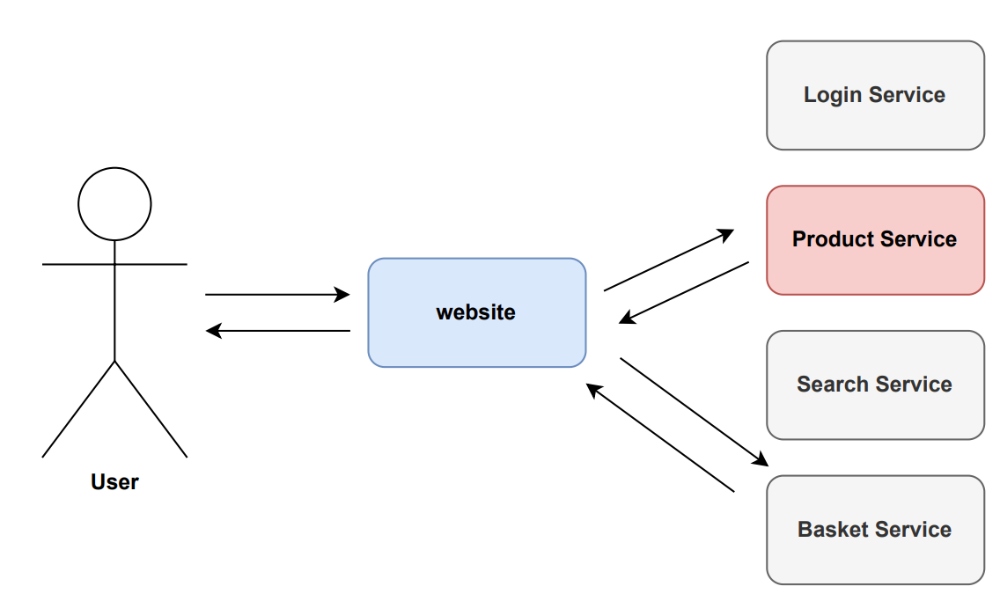

## Microservices & Docker

Main source of inspiration: [ Introduction to Microservices, Docker and Kubernetes (video) ]( https://www.youtube.com/watch?v=1xo-0gCVhTU )

### Microservices Architecture ###

- What are microservices ?
    - Several smaller applications communicating via well defined APIs - usually HTTP.

- Monolithic versus microservices architecture

- Microservices advantages
    - Dynamically SCALABLE at runtime (major advantage)

- Microservices disadvantages
    - Complex networking, Overhead on database and servers

### Docker ###

- What is Docker ?

- What are containers ?
    - Differences of Docker Containers and  Virutal Machines:
        - Docker translation layer (no GUEST OS).
        - Containers share Bins/Libs.

- Dockerfile

### Docker compose ###

- What is Docker Compose and how it performs container orchestration ?
- Example of a docker-compose file (YAML).
- Scaling up containers with docker-compose.

### Let's see in action ###

Implementation of a microservice architecture with Docker.

# Docker hello world

`$ docker ps --all # List all containers`

`$ docker run hello-world`

A more interesting hello world: [ Tutum Hello World! ]( https://hub.docker.com/r/tutum/hello-world )

`$ sudo docker run -d -p 3000:80 tutum/hello-world`

_Scaling up_: change the port, get different instances running.

# Docker concise tutorial

[ Learn Docker in 12 Minutes 🐳 (video)]( https://www.youtube.com/watch?v=YFl2mCHdv24 )

`$ docker build -t hello-world-php .`

`$ docker run -it --rm --name hello-world hello-world-php`

`$ docker run -p 80:80 -v /home/hgtllys/projects/docker-microservices/helloPHP/src:/var/www/html hello-world-php`

# Docker compose concise tutorial

[ Learn Docker Compose in 12 minutes 🐙 (video) ]( https://www.youtube.com/watch?v=Qw9zlE3t8Ko )

Implementation of a simple website in PHP consuming an API written in Python (Flask).

More information about networking with containers: [ Networking in Compose ]( https://docs.docker.com/compose/networking/ ).

